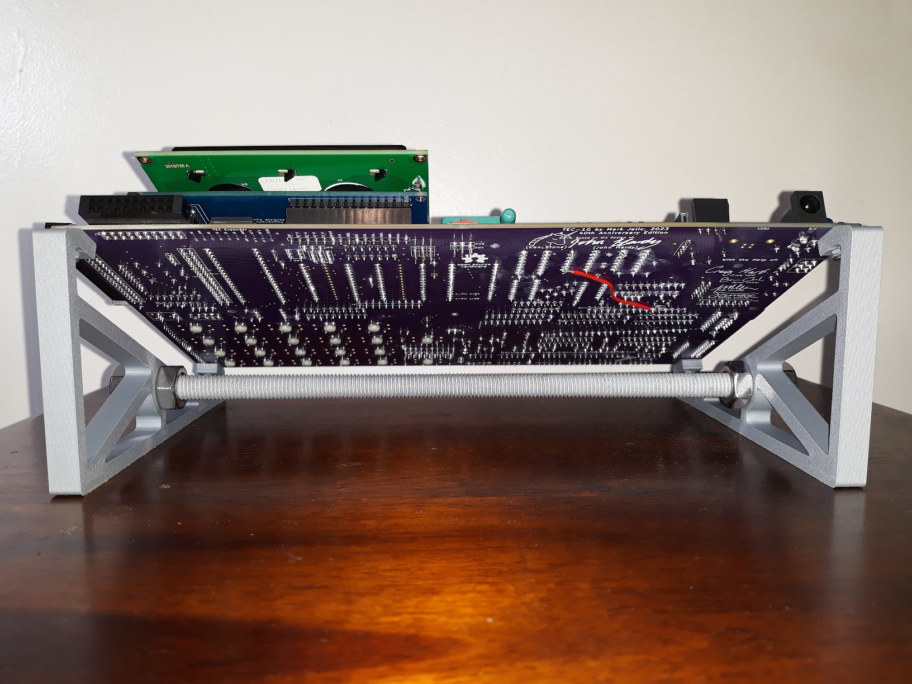
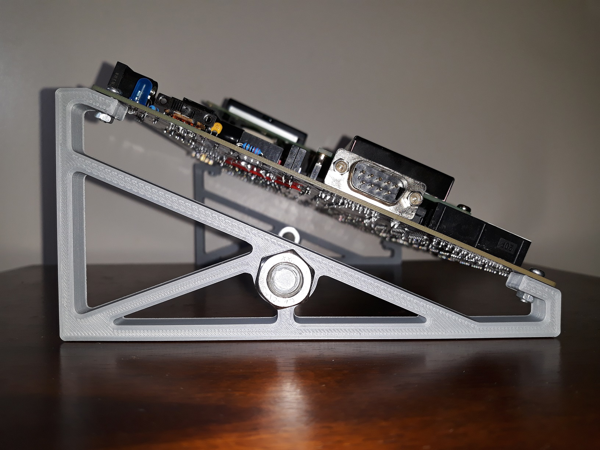
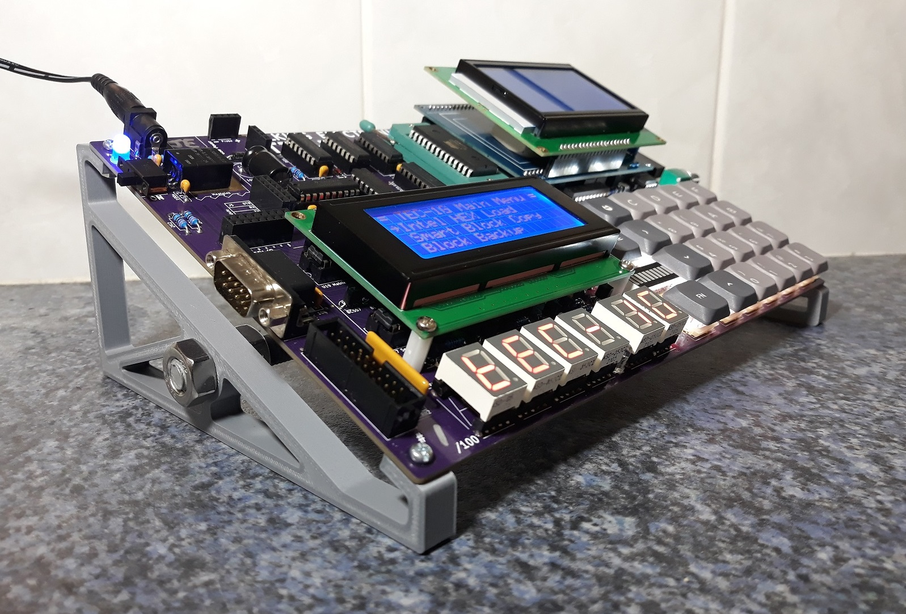

# Stands by James Elphick

**VERSION 1: [JamesE_TEC-1G-Stands_v1.stl](./JamesE_TEC-1G-Stands_v1.stl)**

  This design is Version 1 of a 3D printed PCB stand for the TEC-1G as a platform for display and general use.
  
  Design features:
  1. Print duration ~1.5hr at standard speeds for one set (of 2)
  2. Compatible with 180mm x 180mm print bed size
  3. Minimum use of materials and hence low cost
  4. Provides 23 degree viewing angle
  5. No interference with connectors
  6. Large 18mm gap to PCB underside to accommodate mods
  7. Upgradeable with sturdy M8 threaded rod brace
  8. Identical part used on both L/R sides of PCB
  9. Slots to account for hole tolerancing
  
Parts required for basic stand configuration:
- 4 x M3 bolts - 10mm length
- 4 x M3 nuts
- 2 x 3D printed stands
  
Parts required for OPTIONAL stiffening brace:
- 1 x M8 threaded rod - 262mm cut length
- 4 x M8 nuts (NOTE: 2 x nuts used for clamping stands rigidly in place on each side)
  
Fully tested on the TEC-1G production PCB.

