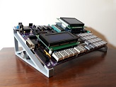

# Cases, Enclosures and Stands

Sick of having you TEC-1G lying on the cold hard bench, with all your tools and parts shorting the underside?

Want to display your beautiful TEC-1G in the best light possible so your friends and family will go "Ooh" and "Ahh" at your cleverness?

Have a 3D printer that has you wondering what you can do with it?

Question no more and pick your favourite design below, download the STL file and elevate your TEC-1G to the height it deserves!

## Stands & Cases Links
| File | Description | Preview |
|---|---|---|
| [JamesE](./JamesE/Readme.md) | A pair of Stands to elevate your TEC-1G to new heights |  |
| [Retex](./Retex/Readme.md) | The original case for the TEC-1 works on the TEC-1G and is still available! |

If you have the superior brain-power required to create 3D models (I most certainly do NOT)
and have designed something for the TEC-1G, why not share it with the greater community?
You will get your own dedicated page on this GitHub, with full credit to you,
and a permenant place in the history of the TEC-1G. Get in touch with us via our [Facebook Forum](https://www.facebook.com/groups/tec1z80).
