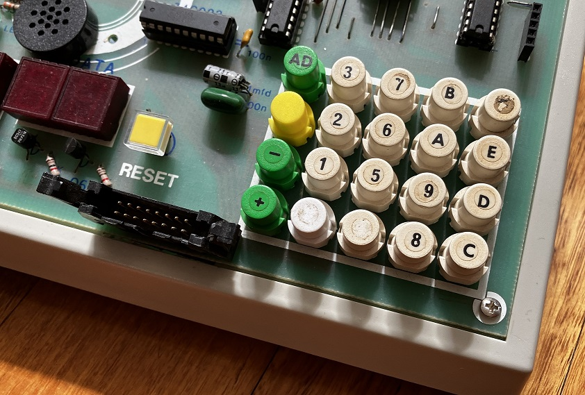
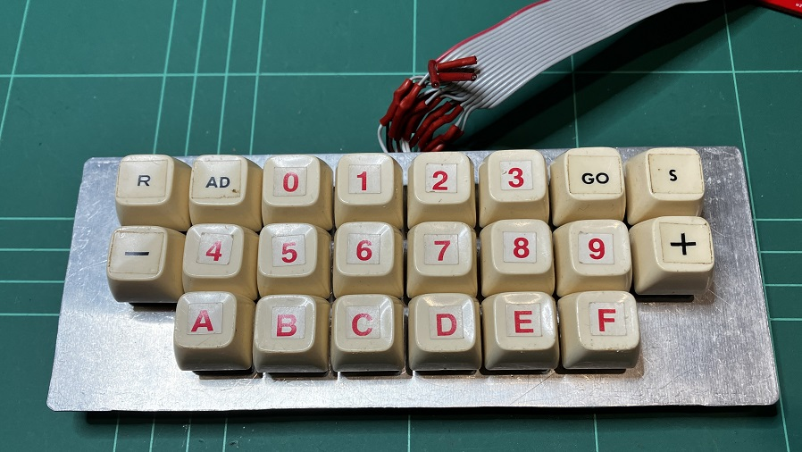
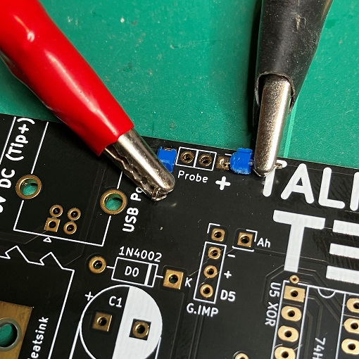
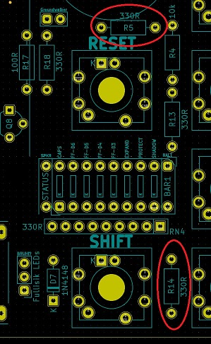
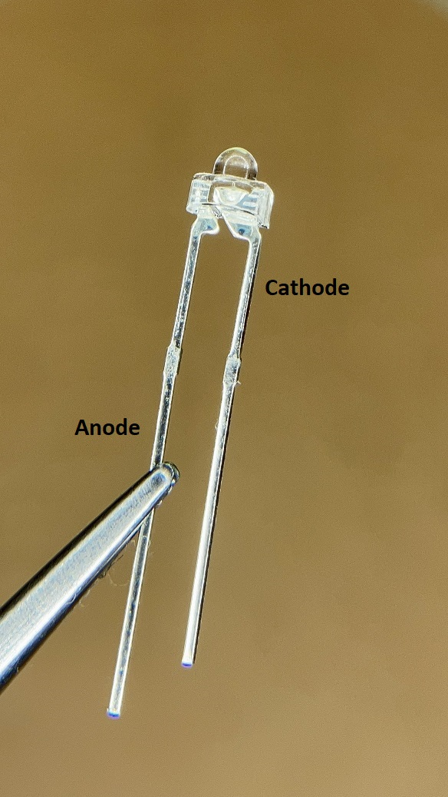

# Assembly Instructions

## 2. The Fullisik Keyboard
So you've opted for the top of the line, sexiest keyboard to ever grace a Single Board Computer. I don't blame you. 
Back when the TEC-1 was... just a 1... I bought the kit from Talking Electronics and it came with the spongiest, most
unresponsive and bouncy keys I had ever had the misfortune of touching.



It took me about 13.2 seconds to decide that this would not do and set about making a mechanical keyboard of my own, all the way back then.



When designing the TEC-1G, there was no way I would go backwards from what I had back in 1983, so of course I had to add under-body LEDs to make it Fully Sick, bro!

OK, enough history, onto the assembly...

---

**Step 1.**  You might as well crack out the bench power supply early as you will be needing it very shortly.
Set it to 5.0 volts and connect it to the Probe connector at the top left of the board. You might want to do as I did
and solder in two temporary pins to allow easy connection with alligator clips. Power up your Power Supply and make sure
there are no shorts and that you do indeed have the correct polarity coming out of the supply.



(Note that on the Anniversary Editions of the board, the silkscreen is incorrect as well as other issues.
See the Errata page for things you need to do to the board **BEFORE** starting assembly.)

**Step 2.** There are two 330 ohm Resistors that are connected to the tiny 1.8mm LEDs, one (R5) above the Reset switch
and the other (R14) to the right of the Shift (Function) key.  These need to be soldered in first.



Once you have the resistors soldered in place, you can solder in the tiny LEDs, of which the orientation of them is critical!
On the PCB there is a small K and the solder pad is square. This indicates where the Cathode of the diode should go.
Which is the Cathode on those tiny LEDS? The short leg is the Cathode and the other way you can tell is
the large metal part inside the plastic lens is usually larger than the anode.



These little things can be tricky to get plumb and square to the PCB, which is a must, as the Gateron Low Profile
keys have to slip over the LEDs to sit flat. So this is the best time for me to give you my technique for
soldering all components. I call it my One Pin Method.

```
When you insert a through-hole component, I always bend the legs out a little
to keep the item in place while I flip the board over. Once flipped though,
if you have followed the Golden Rule of "lowest components first" then
the component should be pressed down to the PCB fairly well, so you can straighten
one of the legs that you will solder first. Go ahead and do so.

**BUT**... Do not solder the other leg, just yet.
```
