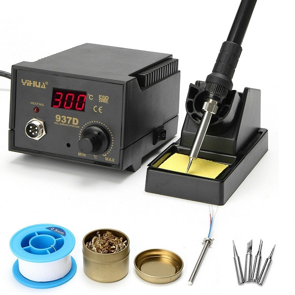
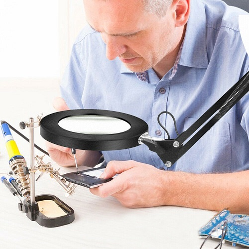
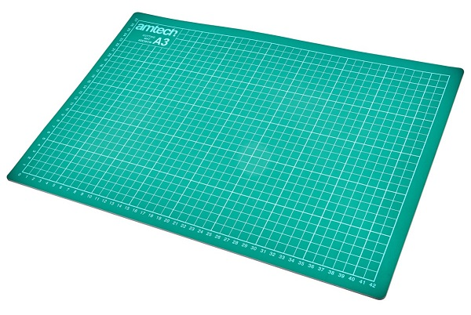
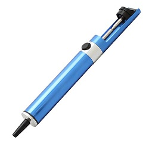
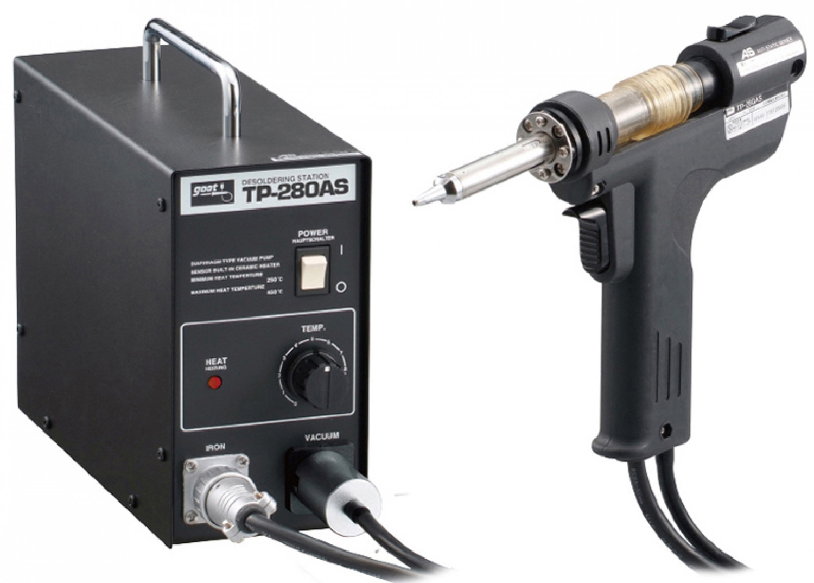
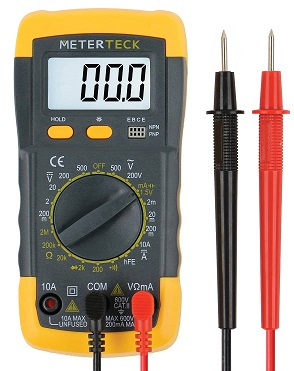

# Assembly Instructions

## 1. Required and Suggested Tools and Materials
Essential to making the TEC-1G is a good, fine-tipped soldering iron, preferably one you can control the temperature of. Try to keep the temperature under 350°C.
Make sure you have a damp sponge or a brass tip cleaning ball to keep your soldering iron clean and shiny.

Fine solder, between .5 to .75mm with a resin flux core is ideal. Many health conscious would like to use lead-free solder but I find this doesn't flow as well as leaded.

Whether you're young or old, a magnifiying light make the precise soldering required a little easier.

Some people swear by proper silicone soldering mats with an anti-static strap, but I've never had one and never fried anything. 

 

But protecting the surface of your bench is a good idea, so I use one of those green cutting mats that every YouTuber seems to have to have.

We're all human and as such make mistakes, so it's good to have a solder sucker, or better, a desoldering station handy.

 

And finally for testing, you will need an inexpensive multimeter.

