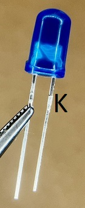

# Components and Identifiers

## The RGB LEDs
The long leg of the RGB LED is the Cathode. 
 

## Standard LEDs
The short leg is the Cathode. 
 

## Network Resistors
The leg with the DOT above it is pin 1. The numbers after it give you the resistance value. 
 

## Diodes
Diodes of all kinds have a solid band printed around one end. This indicates the Cathode. (I think of the band as the upright of the letter K) 
 
