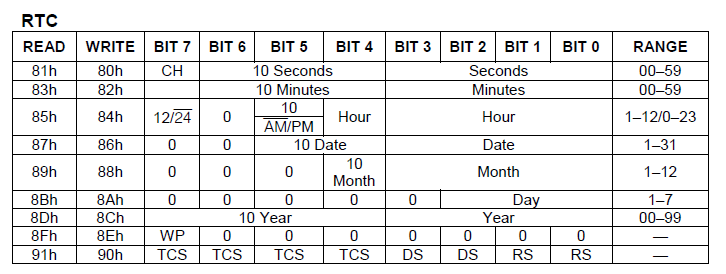

# DS1302 Clock, Calendar and PRAM notes for Programmers

The DS1302 register set presents certain ambiguous choices, which this document seeks to clarify, as well as to document the format of the PRAM area.

## RTC Clock and Calendar

---

When initially accessing the DS1302, Register 8Eh needs to be written with the value 00h. Until this is done, the DS1307 is considered read-only and no changes can be made. Set bit 7 to a 1 to write-protect the DS1302.

Similarly, register 90h should be written with 00h to suit the hardware design of the GPIO RTC board (no trickle charging).

---

The TEC-1G supports both 12 and 24 hour time formats. The register layout makes this a little difficult to understand; this is how it works.

The hours are either 01..12 (12 hour) or 00..23 (24 hour).

Bit 7 of the hour register is a 1 if 12 hour mode is selected
bit 5 of the hour register is a 1 if it is PM (12 hour mode), or part of the hour (24 hour mode)

---

The Year register only supports 2 digits with value range of 00 too 99; hence only a 100 year span is available. This means that a 'base year' needs to be added to the Year value read from the RTC, to arrive at a Calendar year.

TEC-1G designers have determined that 2000 will be the base year. Hence, **CalendarYear = 2000 + RTCYear**

| DS1302 Year | Calendar Year |
| :--: | :----: |
| 00 | 2023 |
| 01 | 2024 |
| 02 | 2025 |
| .. | .... |
| 99 | 2122 |

We wish future TEC-1G users all the best in resolving what happens in 2122 :)

---

The day of week register supports the range 1 to 7; as we know however the actual day that corresponds to any given date varies based on time zone. Therefore, the DS1302 simply incrmeents this value at midnight, but has no knolwege of timezones or what is 'correct'.

TEC-1G designers have followed ISO8601 which defines Moday as the first day of the week. Therefore:

Day 1 = Monday

....

Day 7 = Sunday

---

# PRAM Memory

The DS1302 has 31 bytes of static RAM, which the TEC-1G Designers have named the **P**aramemter **RAM**, or PRAM for short.

Part of the PRAM is set aside for MON3's use. 14 User Bytes are free for software authors to put to any use they see fit.

| PRAM Byte | Purpose |
| :--: | ----- |
|01| Fn-1 Editing Address |
|03| Fn-2 Editing Address |
|05| Fn-3 Editing Address |
|07| Quick Backup - Start address |
|09| Quick Backup - End address |
|11| Quick Backup - Destination address |
|12| Mon3 Reserved |
|13| Mon3 Reserved |
|14| Mon3 Reserved |
|15| Mon3 Reserved |
|16| User Byte |
|17| User Byte |
|18| User Byte |
|19| User Byte |
|20| User Byte |
|21| User Byte |
|22| User Byte |
|23| User Byte |
|24| User Byte |
|25| User Byte |
|26| User Byte |
|27| User Byte |
|28| User Byte |
|29| User Byte |
|30| User Byte |
|31| nnh - Checksum (Two's compliment of MON3 controlled bytes) |

The Checksum is used to verify that the PRAM contents used by MON3 are valid and not corrupted.
