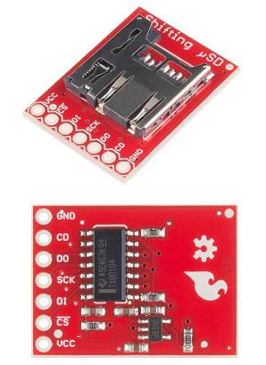
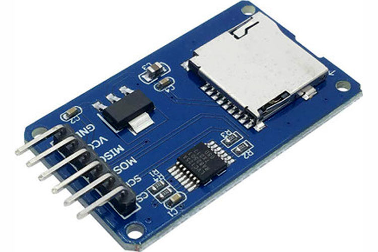

# TEC-1G GPIO SD-Card & 8Bit Input/Output
## Parts List
### Base Parts
| QTY | Part # | Description |
|---|---|---|
| 1 | PCB | TEC-1G GPIO SD-Card Printed Circuit Board |
| 1 | 74HCT32 | Quad OR Gates |
| 1 | 74HCT245 | Octal Buffer |
| 1 | 74HCT273 | Octal D-Type Latch with Clear |
| 1 | 100n | Capacitor |
| 1 | 330R | Resistor |
| 1 | LED | 3mm RED |
| 1 | 14 pin | DIP Socket |
| 2 | 20 pin | DIP Socket |
| 1 | 2x8 pin | Long Legged Female Header |
| 1 | 1x2 pin | Long Legged Female Header |
| 1 | 2x3 pin | 6pin header for selecting Port # (Port $FD for SD Card Use) |
| 1 | Jumper | Port Selection Jumper |
| 2 | 12mm Standoff | M3 Nylon |
| 1 | Screw | M3 Nylon |
| 1 | Nut | M3 Nylon |

Depending on how you wish to use the GPIO, here are the additional parts.

### Additional for use as general 8 Bit Input/Output board
| QTY | Part # | Description |
|---|---|---|
| 2 | 10 pin Female Header Socket, Horizontal | Used to plug in both input and output devices. |
* Two are supplied in the Kit.

### Additional for use as Micro SD Card drive
| QTY | Part # | Description |
|---|---|---|
| 1 | SD Module | Two sorts can be accomodated. See notes below. |
| 1 | 10 pin Female Header Socket, Horizontal | *Optional, to see activity while using SD Card |

Two types of Micro SD Card modules can be used on this board. One is from Sparkfun #13743 (Red module, beliow)
and the other is a generic module found on eBay (in Blue), etc.

* The generic module is supplied in the Kit.

Kits can be purchased from [Tindie](https://www.tindie.com/products/tec1/tec-1g-micro-sd-card-general-inputoutput-kit/)
