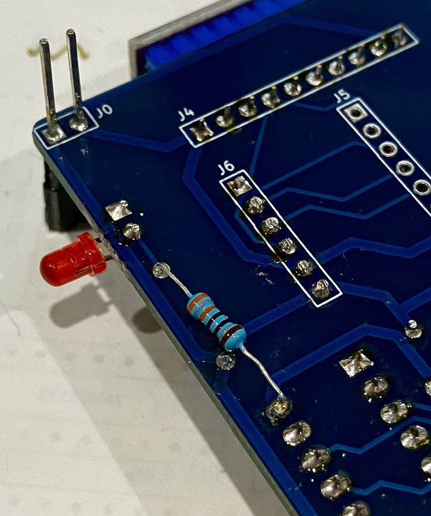

# Micro SD Card Support for TEC-1G

## ERRATA
The first print (Green v1.0) and second print (Blue v1.1) of the GPIO SD-Card board had errors
regarding the Disc Activity LED. The resistor should be tied to +5V, not to GND.

The best way to fix this is to mount the 330 Ohm resistor on the *underside* of the PCB.
Insert the upper leg (closest to the LED) as normal but from the underside. And the other
leg of the resistor should be soldered to Pin 20 of the 74HCT273, which is +5V.

| File | Description | Version |
|---|---|---|
| [Schematic](TEC-1G_GPIO_SD-Card_Schematic_v1-2.pdf) | It's a simple circuit, but it's honest storage. | 1.2 |
| [Parts List](./Partslist.md) | What you need to buy (and comes in the Kit) | 1.0 |
| [Assembly Instructions](./Assembly.md) | Coming Soon... | 1.0 |
| [PCB Gerbers]() | Coming Soon... | 1.0 |
| [Sample Programs](./Programs/) | Sample code and API reference | 1.0 |

## What Does it Do?
This GPIO expansion can perform two functions, based on whether you have a Micro SD Card module attached to it, or not.
1. With an SD Card module attached, it allows for the use of Micro SD cards to act as your "floppy disc" or "disk drive"
of your TEC-1G.  No more hoping a Cassette Deck is going to be at the right volume. No huge disk drives that take up a lot of room.
Running short of space on your current SD Card? Eject it and insert a new one. Format it for use on the TEC-1G and you are
away with a 128 file capacity.

2. Without an SD Card Module, you can use this board as a General Input & Output board to read up to 8 single inputs
and output to 8 individeual outputs, which could for example, drive a relay board.

## How Does It Work
To use it as an SD Card interface as supported by MON3, the Port Selection jumper must be on $FD. 
If using it as a General Input/Output controller, you have a choice of three (3) ports, which
also means you can stack three of these cards on top of each other and have up to 24 inputs and 24 outputs!

## Why Build It?
Ever wanted your TEC-1 to be your Alarm System? It can be and there used to be a few commercial alrm systems that used the Z80 at their heart!

## How Do You Use It?
The clever people at <b>TEC-1 Inc.</b> will soon release an API as part of MON3.
All this and more, <b>Coming Soon®...</b>

