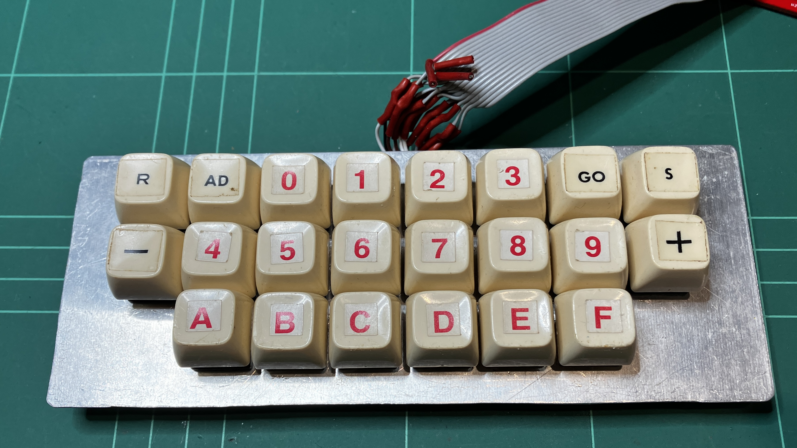
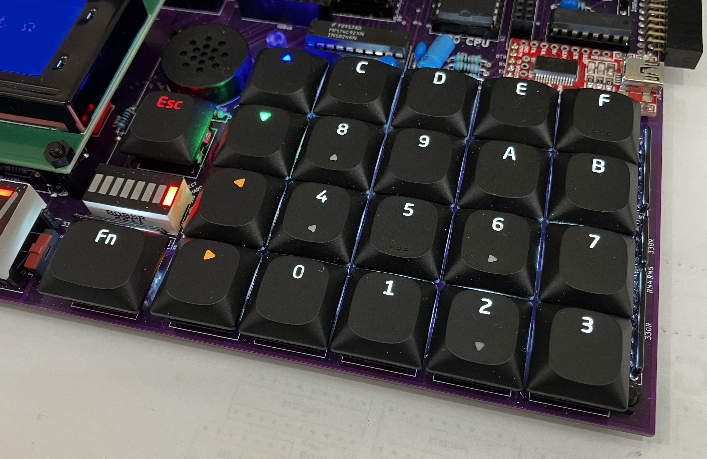

# Keyboards for the TEC-1G

## History
The TEC-1 came out in 1983 and I eagerly built it, and coded many of the samples and even made my own maze game all entered by hand on, lets face it, the crappy mushy keyboard with the terrible layout. I didn't stand for it for too long before I made my own keyboard out of full sized keys. Still only in hex, but man it made a difference!

Fast forward 40 years and the TEC-1G was NOT going to have crappy keys any longer! Discussions with another Keyboard officiando, Ian McLean came to making space on the TEC-1G motherboard to fit full-zized mechanical keys.  We chose to use the Gateron Low Profile 2.0 keys as they were a lot less obtrusive compared to the normal Cherry MX keys. Unfortunately the footprint of the Gateron Low Profiles is NOT the same as a standard MX key, so keep that in mind when buying your key switches.

You can purchase the Gateron LP Switches [direct from the Gateron site](https://www.gateron.com/products/gateron-ks-33-low-profile-switch-set?VariantsId=10265).

## Matrix Interface
The Matrix Interface made for the TEC-1 was essentially incorproated into the design of the TEC-1G. More details and code samples can be found with [this Link.](https://github.com/MarkJelic/TEC-1_Hardware/tree/master/Z80Bus/Keyboard)

## The Tactile Keyboard
I created the Tactile version of the Matrix Keyboard that accepted 6mm and 12mm little tactile keys which aren't terrible and relatively cheap. You can get more details of how it was developed, [here](./Tactile/)

## The Mechanical Keyboard (in development)
[A full mechanical keyboard](./Mechanical/) is in development and will use the Gateron Low Profile key switches with Fullisik LED lighting!

## Where to Buy
The Tactile Matrix Keyboard Kit can be found on eBay:  https://www.ebay.com.au/itm/175756969668

Likewise the Mechanical Kit will also be available on eBay, soon.
