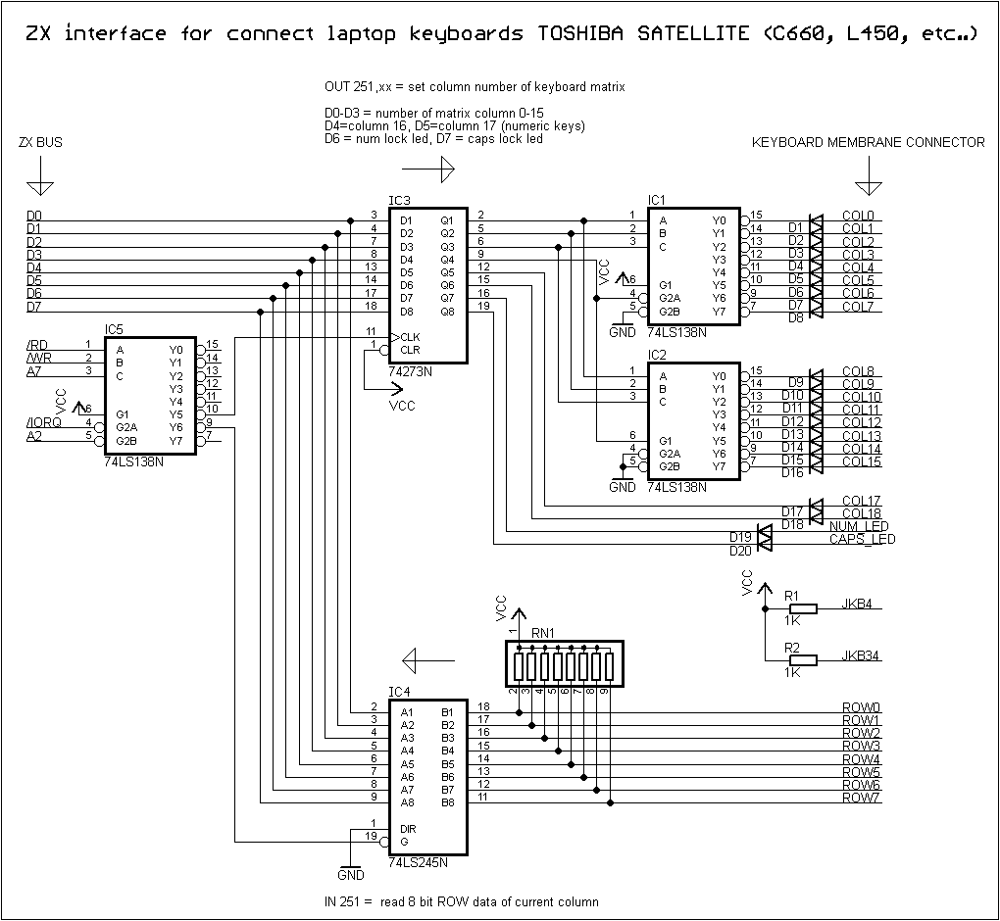

# Full QWERTY Matrix Keyboard for the TEC-1

## History
The TEC-1 came out in 1983 and I eagerly built it, and coded many of the samples and even made my own maze game all entered by hand on, lets face it, the crappy hex keyboard with the terrible layout. I didn't stand for it for too long before I made my own keyboard out of full sized keys. Still only in hex, but man it made a difference!

Fast forward 40 years (Happy Anniversary, TEC-1!) and I'm still hating on the keyboard. LOL! But I was always on the lookout for some way to get a full sized QWERTY keyboard onto the TEC-1. I gathered schematics and circuit designs from all across the internet... Here are just a few.

## Design Process
I finally came across a keyboard interface for the RC2014 designed by [Marco Maccaferri](https://www.maccasoft.com/electronics/matrix-keyboard-for-rc2014/) that claimed the design was basically how the ZX Spectrum did its keyboard scanning. So I figured, if it was good enough for the Spectrum... And the best part was that Marco included some incredibly simple source code that even I could follow along. I had struck gold!

I quickly went about making a prototype of just a hex keypad, but using his matrix. It worked OK, but the output was not what I wanted. This is where Brian Chiha came into the scene with his black belt in Z80 Assembly-Fu. We discussed that the key matrix needed to be rejigged and put in an order that matched the linear progression of the ASCII table. I got to work on that while Brian rejigged the code.

We worked well together (I believe the youth of today call this a "colab") and in very short order, a keyboard PCB was design and printed and a working sample sent to Brian for final development of the code, and make a new video for his popular channel on YouTube featuring the Z80Bus Matric Keyboard.

## Matrix Interface
The brains of the Matrix Keyboard is held in this [interface board](./Matrix_Interface/) that slots into a Z80Bus socket.

## The Tactile Keyboard
The tactile keyboard details and assembly instructions can be found [here](./Tactile_Keyboard/)

## The Cherry Keyboard (in development)
[A full mechanical keyboard](./Mechanical_Keyboard/) is in development!

## Where to Buy
Four PCB Bundle: https://www.ebay.com.au/itm/175695718002

Matrix Interface Kit:  https://www.ebay.com.au/itm/175681760580
