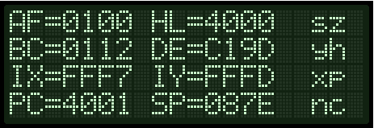

# MON-3 API guide

## General Conventions
C register - holds API Call number.

Executing an RST 10H opcode calls the API.
```
        ld c,[API Call Number]
        rst 10H
```
- Any parameters are passed in the A, B, DE and/or HL registers, depending on the requirements of each call.

- Results are returned in various registers and/or by altering memory as shown within each call.

Note: if a register is maked as destroyed - that means the value of the register is altered in an undefined manner by the API call, and thus should not be relied upon to contain any specific value after the API call runs.
```
    Some Examples:

        ;Produce a short Beep from the speaker
        ld c,3      ;beep call number
        rst 10H

        ;Display the letter 'G' on the LCD Screen
        ld c,14     ;charToLCD call number
        ld a,"G"    ;parameter
        rst 10H

        ;Wait for a period of time
        ld c,33     ;timeDelay call number
        ld hl,3000H ;parameter
        rst 10H
```
---
## API Calls list - MON-3 1.0 (BC23-10 ROM Image)

| Routine | Call Number | Hex Number | MON-3 Version Supported |
| ---------------------- | :--: | :--: | :-------: |
| [_softwareID](#_softwareid)    | 0 | 00H | BC23-10 |
| [_versionID](#_versionid)      | 1 | 01H | BC23-10 |
| [_preInit](#_preinit)          | 2 | 02H | BC23-10 |
| [_beep](#_beep)                | 3 | 03H | BC23-10 |
| [_convAToSeg](#_convatoseg)    | 4 | 04H | BC23-10 |
| [_regAToASCII](#_regatoascii)  | 5 | 05H | BC23-10 |
| [_ASCIItoSegment](#_asciitosegment)   | 6 | 06H | BC23-10 |
| [_stringCompare](#_stringcompare)    | 7 | 07H | BC23-10 |
| [_HLToString](#_hltostring)       | 8 | 08H | BC23-10 |
| [_AToString](#_atostring)        | 9 | 09H | BC23-10 |
| [_scanSegments](#_scansegements)     | 10 | 0AH | BC23-10 |
| [_displayError](#_displayerror)     | 11 | 0BH | BC23-10 |
| [_LCDBusy](#_lcdbusy)          | 12 | 0CH | BC23-10 |
| [_stringToLCD](#_stringtolcd)      | 13 | 0DH | BC23-10 |
| [_charToLCD](#_chartolcd)        | 14 | 0EH | BC23-10 |
| [_commandToLCD](#_commandtolcd)     | 15 | 0FH | BC23-10 |
| [_scanKeys](#_scankeys)         | 16 | 10H | BC23-10 |
| [_scanKeysWait](#_scankeyswait)     | 17 | 11H | BC23-10 |
| [_matrixScan](#_matrixscan)       | 18 | 12H | BC23-10 |
| [_joystickScan](#_joystickscan)     | 19 | 13H | BC23-10 |
| [_serialEnable](#_serialenable)     | 20 | 14H | BC23-10 |
| [_serialDisable](#_serialdisable)    | 21 | 15H | BC23-10 |
| [_txByte](#_txbyte)           | 22 | 16H | BC23-10 |
| [_rxByte](#_rxbyte)           | 23 | 17H | BC23-10 |
| [_intelHexLoad](#_intelhexload)     | 24 | 18H | BC23-10 |
| [_sendToSerial](#_sendtoserial)     | 25 | 19H | BC23-10 |
| [_receiveFromSerial](#_receivefromserial) | 26 | 1AH | BC23-10 |
| [_sendAssembly](#_sendassembly)     | 27 | 1BH | BC23-10 |
| [_sendHex](#_sendhex)          | 28 | 1CH | BC23-10 |
| [_genDataDump](#_gendatadump)      | 29 | 1DH | BC23-10 |
| [_checkStartEnd](#_checkstartend)    | 30 | 1EH | BC23-10 |
| [_menuDriver](#_menudriver)       | 31 | 1FH | BC23-10 |
| [_paramDriver](#_paramdriver)      | 32 | 20H | BC23-10 |
| [_timeDelay](#_timedelay)        | 33 | 21H | BC23-10 |
| [_playNote](#_playnote)         | 34 | 22H | BC23-10 |
| [_playTune](#_playtune)         | 35 | 23H | BC23-10 |
| [_playTuneMenu](#_playtunemenu)     | 36 | 24H | BC23-10 |
| [_getCaps](#_getcaps)          | 37 | 25H | BC23-10 |
| [_getShadow](#_getshadow)        | 38 | 26H | BC23-10 |
| [_getProtect](#_getprotect)       | 39 | 27H | BC23-10 |
| [_getExpand](#_getexpand)        | 40 | 28H | BC23-10 |
| [_setCaps](#_setcaps)          | 41 | 29H | BC23-10 |
| [_setShadow](#_setshadow)        | 42 | 2AH | BC23-10 |
| [_setProtect](#_setprotect)       | 43 | 2BH | BC23-10 |
| [_setExpand](#_setexpand)        | 44 | 2CH | BC23-10 |
| [_toggleCaps](#_togglecaps)       | 45 | 2DH | BC23-10 |
| [_toggleShadow](#_toggleshadow)     | 46 | 2EH | BC23-10 |
| [_toggleProtect](#_toggleprotect)    | 47 | 2FH | BC23-10 |
| [_toggleExpand](#_toggleexpand)     | 48 | 30H | BC23-10 |
| [_random](#_random)     | 49 | 31H | BC23-11 |
| [_setDisStart](#_setDisStart)     | 50 | 32H | BC23-12 |
| [_getDisNext](#_getDisNext)      | 51 | 33H | BC23-12 |
| [_getDisassembly](#_getDisassembly)    | 52 | 34H | BC23-12 |
| [_matrixScanASCII](#_matrixScanASCII) | 53 | 35H | BC23-12 |


Future MON-3 versions may introduce additional API calls - therefore code using calls not present in version MON-3 1.0 should first call _versionID to determine that the MON-3 version supports the calls being made.

----
### _softwareID 
Get Software ID String
```
Input: nothing
Return: HL = Pointer to SOFTWARE ASCIIZ String
Destroys: none
```
### _versionID
Get Version Number and Version String
```
Input: nothing
Return: HL = Pointer to Release ASCIIZ String
        BC = Release major version number
        DE = Release minor version number
Destroys: none
```
BC contains the binary value for the design year. MON-3 1.0 returns 07E7H for the year 2023. Future versions should carry the year of release.
DE contains the binary value for the design revision. MON-3 1.0 returns 0003H for design revison 3. Future versions should increment this value.
The ASCIIZ string is a concatenation of the above values. MON-3 1.0 returns "2023.03",0
### _preInit
Performs a hard boot, as if the TEC-1G had just been powered on. Returns to MON-3 in default state.

### _beep
Makes a short beep tone
```
Input: nothing
Destroys: A
```
### _convAToSeg
Convert register A to Seven Segment
```
Inputs: A = byte to convert
        DE = address to store segment values (2 bytes)
Destroys: BC
```
### _regAToASCII
Convert register A to ASCII. IE: 2CH -> "2C"
```
Input: A = byte to convert
Output: HL = two byte ASCII string
Destroys: A
```
### _ASCIItoSegment
ASCII to Segment.  Converts an ASCII character to Seven Segment character
```
Input: A = ASCII character
Return: A = Segment character or 0 if out of range
Destroys: none
```
### _stringCompare
Compare two string
```
Input: HL = source pointer
       DE = target pointer
       B = #bytes to compare (up to 256)
Output: Zero Flag Set = compare match
Destroys: HL, DE, A, BC
```
### _HLToString
Convert HL to ASCII string. IE: 2CH -> "2C"
```
Input: HL = value to convert
       DE = address of string destination
Output: DE = address one after last ASCII entry
Destroys: A
```
### _AToString
Convert register A to ASCII string
```
Input: A = byte to convert
       DE = address of string destination
Output: DE = address one after last ASCII entry
Destroys: A
```
### _scanSegements
Multiplex the Seven Segment displays with the contents of DE
```
Inputs: DE = 6 byte location of segment data
Destroys: A, B
```
### _displayError
Display ERROR on the 7Segs and wait for key press
```
Input: none
Destroys: all
```
### _LCDBusy
LCD busy check.  Checks the LCD busy flag and loops until LCD isn't busy
```
Input: nothing
Destroys: none
```
### _stringToLCD
ASCII string to LCD.  Writes a string to the current cursor location on the LCD
```
Input: HL = ASCII string terminated with zero byte
Destroys: A, HL (moves to end of list)
```
### _charToLCD
ASCII character to LCD.  Writes one character to the LCD at the current cursor location
```
Input: A = ASCII character
Destroys: none
```
### _commandToLCD
Command to LCD.  Sends an LCD instruction to the LCD
```
Input: B = Instruction byte
Destroys: none
```
### _scanKeys
Universal Key input detection routine. Supports HexPad and Matrix. Does not wait for a key press - returns immediately.
```
Return: A = key value (if following are met)
    zero flag set if a key is pressed
    carry flag set if press detected of a new key
    carry flag not set for key pressed and held
Destroys: DE if using Matrix Keyboard
```
### _scanKeysWait
Generic Key input detection routine. Supports HexPad and Matrix. Waits until a key is pressed.
```
Return: A = key value (if following are met)
    zero flag set if key is pressed
Destroys: DE if using Matrix Keyboard
```
### _matrixScan
Key scan routine for the Matrix Keyboard.  This routine detects up to two key presses at the same time.  Key values stored in DE.  Routine must be called repetitively.
```
Input: None
Output: E = Key pressed between 00H-3FH (0-64)
        D = Second key, FF=no key, 00=shift, 01=Ctrl, 02=Fn
        zero flag set if a key is pressed or combination valid
```
### _joystickScan
Joystick port scan routines.  This routine will return a value based on the movement / button of the joystick or any combination: IE: UP+DOWN = 03H, Routine must be called repetitively.
```
Input: None
Output: A = Joystick return value between 00H-5FH (0-95)
      01H = Up        10H = Fire 2
      02H = Down      20H = Comm2 (Pin 9)
      04H = Left      40H = Fire 1
      08H = Right     80H = Fire 3
        zero flag set if no joystick value returned
Destroys: none
```
### _serialEnable
Activates the BitBang serial port for serial transfer.  Disco LED's glow blue to indicate ready status.
```
Input: none
Destroys: A
```
### _serialDisable
Deactivates the BitBang serial port for serial transfer.  Disco LEDs turn off.
```
Input: none
Destroys: A
```
### _txByte
Bit Bang FTDI USB transmit routine.  Transmit one byte via the FTDI USB serial connection.  It assumes a UART connection of 4800-8-N-2.
```
Input: A = byte to transmit
Output: nothing
Destroys: none
```
### _rxByte
Bit Bang FTDI USB receive routine.  Receive one byte via the FTDI USB serial connection.  It assumes a UART connection of 4800-8-N-2.  Note routine will wait until a bit is detected.
```
Input: nothing
Return: A = byte received
Destroys: none
```
### _intelHexLoad
Load an Intel Hex file via the FTDI USB serial connection.  Displays file progress on the segments and PASS or FAIL at the end of the load.  Intel Hex file format is a string of ASCII with the following parts:
```
:10200000210621CD7D20CD98203A00213C320021AF <- EXAMPLE LINE
```
| MARK | LENGTH | ADDRESS | RECORD TYPE | DATA | CHECKSUM |
| :-: | :--: | :----: | :--: | :---------------: | :--: |
|:|10|2000|00|210621CD7D20CD98203A00213C320021|AF|

MARK is a colon character, LENGTH is the number of DATA bytes per line,  ADDRESS is the 2 byte address of where the data is to be stored.  RECORD TYPE is 00 for Data and 01 for EOF.  DATA is the bytes to be stored.  CHECKSUM is the addition of all bytes in the one line modulo 256, and taking the two's compliment.
```
Input: nothing
Output: nothing
Destroys: HL,DE,BC,A
```
### _sendToSerial
SIO Binary Dump.  Transfer data on the TEC to a serial terminal.  From and To address data is needed and input.
```
Input: 2 byte from address = Stored in RAM at address 08C0H
       2 byte to address = Stored in RAM at address 08C2H
Destroys: A,HL,DE,BC
```
### _receiveFromSerial
SIO receive binary data.  Receive binary data from FTDI.  From and To address data is needed and input.
```
Input: 2 byte from address = Stored in RAM at address 08C0H
       2 byte to address = Stored in RAM at address 08C2H
Destroys: A,HL,DE,BC
```
### _sendAssembly
Send Assembly instructions to the serial port.  Print out code disassembly.  Receive binary data from FTDI.  From and To address data is needed and input.
```
Input: 2 byte from address = Stored in RAM at address 08C0H
       2 byte to address = Stored in RAM at address 08C2H
Destroys: A,HL,DE,BC
```
### _sendHex
Send a traditional HEX dump as text to the serial terminal.  Upto 16 bytes are displayed per line.    From and To address data is needed and input.
```
Input: 2 byte from address = Stored in RAM at address 08C0H
       2 byte to address = Stored in RAM at address 08C2H
Destroys: A,HL,DE,BC
```
### _genDataDump
Generate data dump in ASCII.  Print Address and then C number of bytes
```
Input: B = number of bytes to display
       HL = start address of data dump
       DE = address of string destination
Output: DE = zero terminated address one after last ASCII entry
          IE: "4000: 23 34 45 56 78 9A BC DE",0
Destroys: A, HL (moves to next address after last byte)
```
### _checkStartEnd
Check start and end address difference.
```
Input: HL = address location of START value
       HL+2 = address location of END value
Output: HL = start address
        BC = length of end-start
        Carry = set if end is less than start
Destroys: DE
```
### _menuDriver
Menu driver for external applications.  Creates a selectable custom menu.  Keys: Go = Select menu item, AD = Exit Menu, +/- = Navigate menu
```
Input: HL = Pointer to Menu configuration. (See Note)
Destroys: A, HL

Note: Menu configuration is as follows.  All strings are ZERO terminated!
<Menu Entries>, <Menu Text Title>, [<Menu Text Label>, <Menu Routine Address>]+
  EG: .db 2                 ;Two menu items
      .db "Games",0         ;Menu title
      .db "TEC Invaders",0  ;Text and Routine
      .dw invaders
      .db "TEC Maze",0      ;Text and routine
      .dw maze
```
### _paramDriver
Parameter data entry driver.  Creates a list of editable two byte parameters.  Keys: Go = Continue, AD = Exit, +/- = Navigate, 0-F = enter values
```
Input: HL = Pointer to Parameter configuration. (See Note)
Note: Parameter configuration is as follows.  All strings are ZERO terminated!  Parameter text can be no longer than 14 characters
<No. of Entries>, <Parameter Title Text>, [<Param Text Label>, <Param RAM Address>]+
  EG: .db 3                         ;Three parameters
      .db "= Enter Parameters =",0  ;Parameter title
      .db "Start Address:",0        ;Text and Address
      .dw COPY_START
      .db "End Address:",0          ;Text and Address
      .dw COPY_END
      .db "Dest. Address:",0        ;Text and Address
      .dw COPY_DEST
```
### _timeDelay
A 16 bit delay routine.
```
Input: HL = delay amount
Destroys: none
``` 
### _playNote
Play a note.  Play a note with a given frequency and wavelength
```
Input: HL = frequency (01-7F)
       B = wavelength (00-FF)
Destroys: HL, BC, A
```
### _playTune
Play a series of notes.  To play a note use a reference between 01H and 18H.  Where 01H is the lowest and 18h is the highest.  Use 00H to make a pause and any value greater then 18H to exit.

Note reference table is as follows:
|Note |Value|
|-----|-----|
|  G  | 01H |
|  G# | 02H |
|  A  | 03H |
|  A# | 04H |
|  B  | 05H |
|  C  | 06H |
|  C# | 07H |
|  D  | 08H |
|  D# | 09H |
|  E  | 0AH |
|  F  | 0BH |
|  F# | 0CH |
|  G  | 0DH |
|  G# | 0EH |
|  A  | 0FH |
|  A# | 10H |
|  B  | 11H |
|  C  | 12H |
|  C# | 13H |
|  D  | 14H |
|  D# | 15H |
|  E  | 16H |
|  F  | 17H |
|  F# | 18H |

```
Input: DE = Address of first note
Destroys: A,B,DE,HL
```
### _playTuneMenu
Play tune routine above but address of notes is set via a parameter menu.
### _getCaps
Get Caps lock state
```
Input: none
Output: A = caps lock state; 0 = off, 80H = on
```
### _getShadow
Get SHADOW state
```
Input: none
Output: A = shadow state; 0 = off, 01H = on
```
### _getProtect
Get PROTECT state
```
Input: none
Output: A = protect state; 0 = off, 02H = on
```
### _getExpand
Get EXPAND state
```
Input: none
Output: A = expand state; 0 = off, 04H = on
```
### _setCaps
Set Caps lock state
```
Input: A = Desired caps lock state; 0 = off, 80H = on
Destroys: A
```
### _setShadow
Set Shadow state
```
Input: A = Desired shadow state; 0 = off, 01H = on
Destroys: A
```
### _setProtect
Set Protect state
```
Input: A = Desired protect state; 0 = off, 02H = on
Destroys: A
```
### _setExpand
Set Expand state
```
Input: A = Desired expand state; 0 = off, 04H = on
Destroys: A
```
### _toggleCaps
Toggle Caps Lock state
```
Input: none
Destroys: A
```
### _toggleShadow
Toggle Shadow state
```
Input: none
Destroys: A
```
### _toggleProtect
Toggle Protect state
```
Input: none
Destroys: A
```
### _toggleExpand
Toggle Expand state
```
Input: none
Destroys: A
```
### _random
Generate a Pseudo Random number between 00-FF
```
Input: none
Output: A = random byte
Destroys: B
```
### _setDisStart
Set Disassembly start address.  Set the first address for disassembly output 
```
Input: HL = start address
Output: none
Destroy: none
```
### _getDisNext
Get Disassembly next address.  The new start address for the next output.  
```
Input: none
Output: HL = start address
Destroy: none
```
### _getDisassembly
Generate Disassembly line.  Must call setDisStart prior.  Only need to call setDisStart once as the next address is automatically increased.
```
Input: none
Output: HL = pointer to disassembly ASCII, zero terminated
Destroy: none
```
### _matrixScanASCII
Convert the output of the matrixScan routine to ASCII.  matrixScan returns values between 0 and 64, these represent key presses on the keyboard.  This routine will convert the output of matrixScan DE, to the actual key pressed in ASCII.  If key doesn't map to an ASCII character then the matrix key value is returned.
```
Input: DE = value return from matrixScan.
   E = key, D = Secondary key
Output: A = key pressed in ASCII
Destroy: BC, HL
```
---
## Breakpoints and Debugger

Executing an RST 30H opcode calls the built-in Debugger. The message  is also displayed on the 7-seg displays to indicate that a Breakpoint is active.



As this is a single-byte (opcode F7H), it becomes very simple to insert this opcode into your program wherever a breakpoint is needed. Later on the opcode can be removed or simply replaced with NOP (opcode 00H) when no longer required.

The debugger shows the state of the primary Z80 registers and the flags. If the flag letter is a capital, the flag is set; if lower case, flag is clear. x and y represent the two undefined bits of the flags register. Flags are shown in register-bit-order, bit 7 (sign) down to bit 0 (Carry).

| Letter | Flag |
| - | ---- |
| s | Sign |
| z | Zero |
| y | (undefined) |
| h | Half Carry |
| x | (undefined) |
| p | Parity/Overflow |
| n | Add/Subtract |
| c | Carry |

At this time the Z80 alternate registers (AF', BC' etc.) are not shown, this feature may be added in a future MON-3 release.

### Debugger navigation keys

**GO** key exits the debugger and returns to the next instruction.

**ADDR** key exits the debugger and returns to MON-3.

