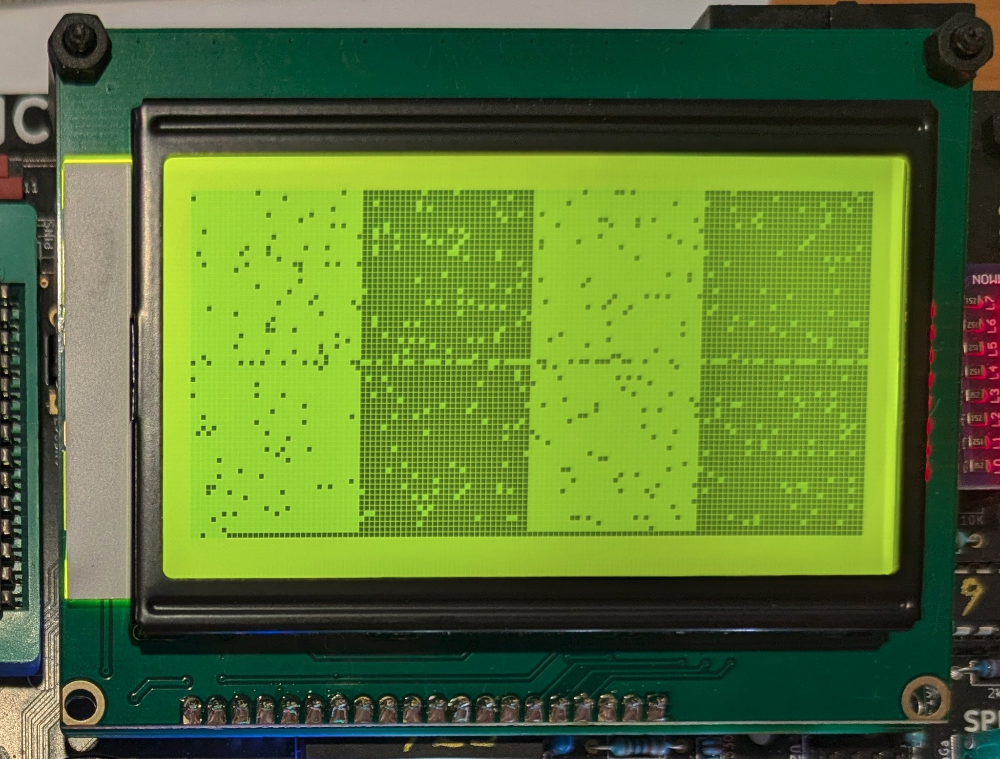
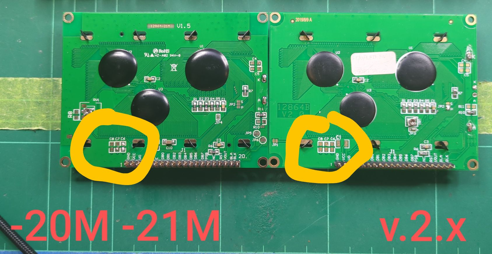
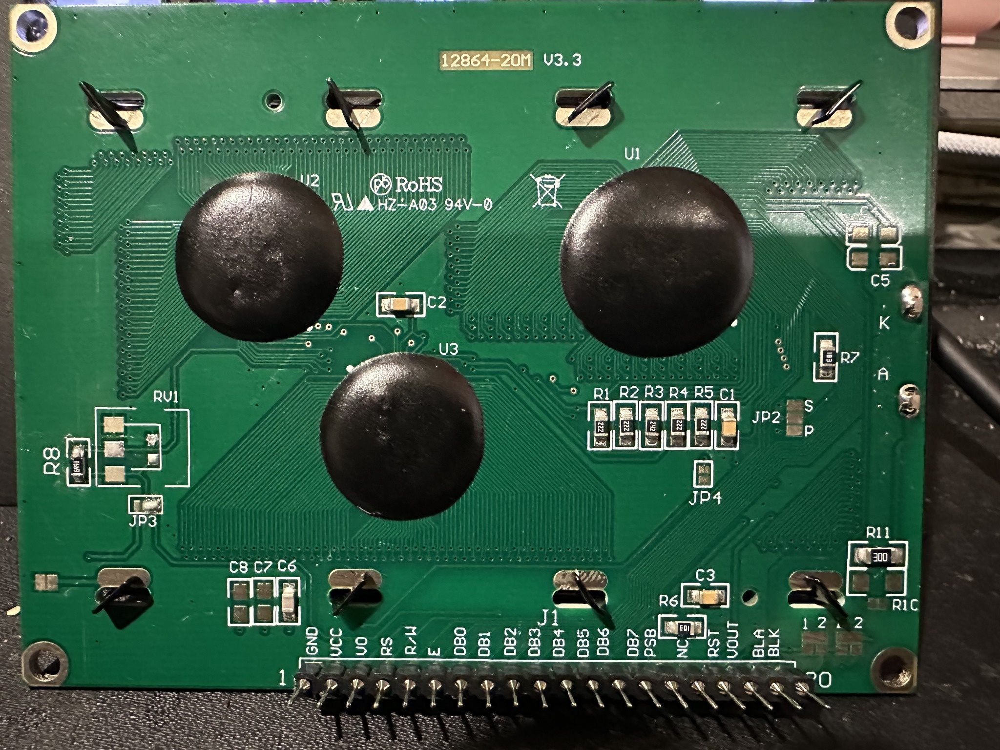
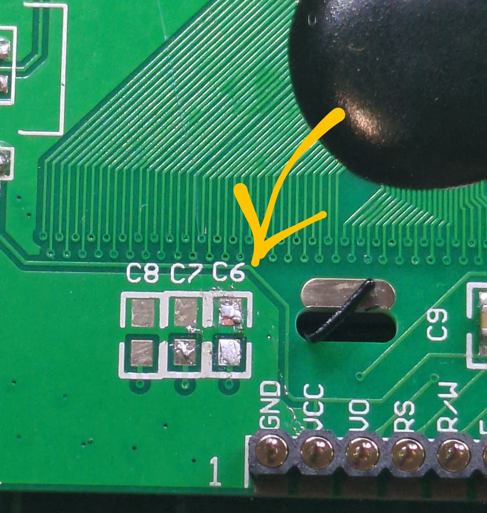

# Errata - Garbled Screen

If you get a garbled screen similar to this, there is a simple fix. 

The older versions of the display did not have a capacitor installed at C6 but for some reason
they are in the latest versions, and this can cause timing ussues for the Z80.

Check on the back of your 128x64 GLCD module and locate the capacitor marked C6, usually
mounted at the bottom left.

Just get a pair of snips and cut the capacitor off. (You can try to be tidier and use a soldering
or desoldering iron... But snipping it off is fast and effective.)

