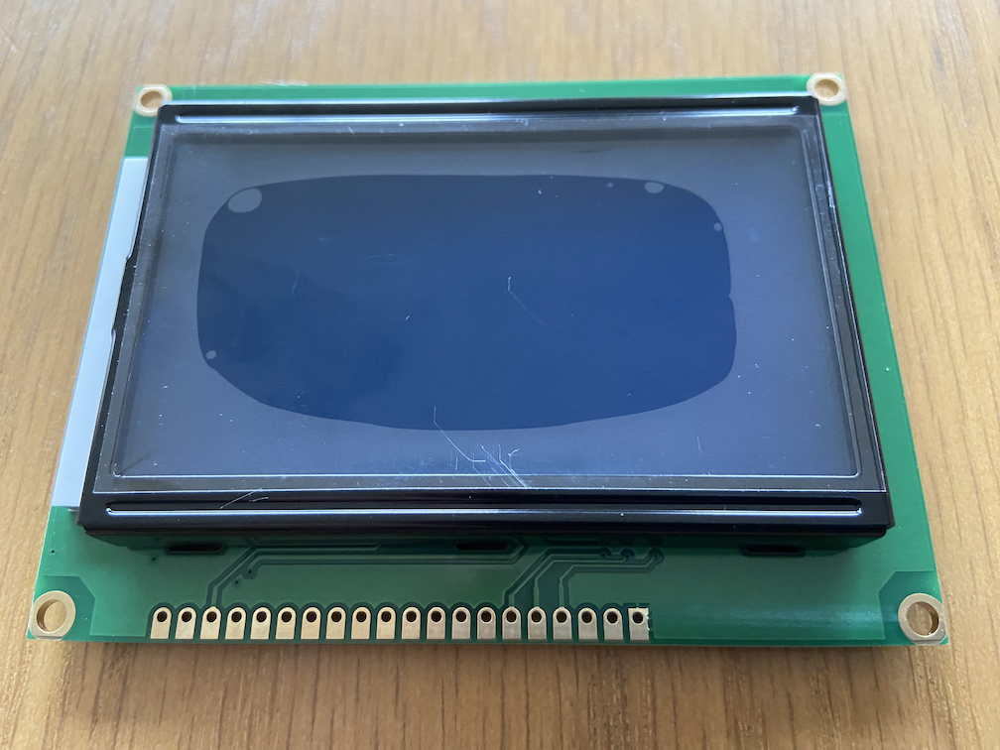
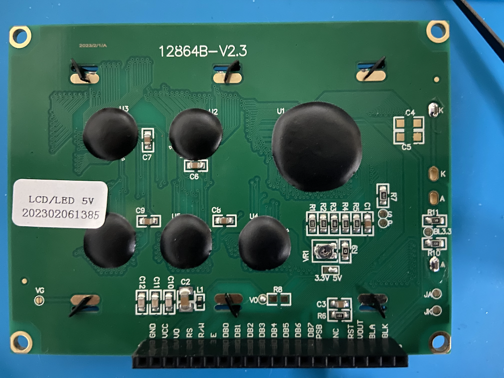
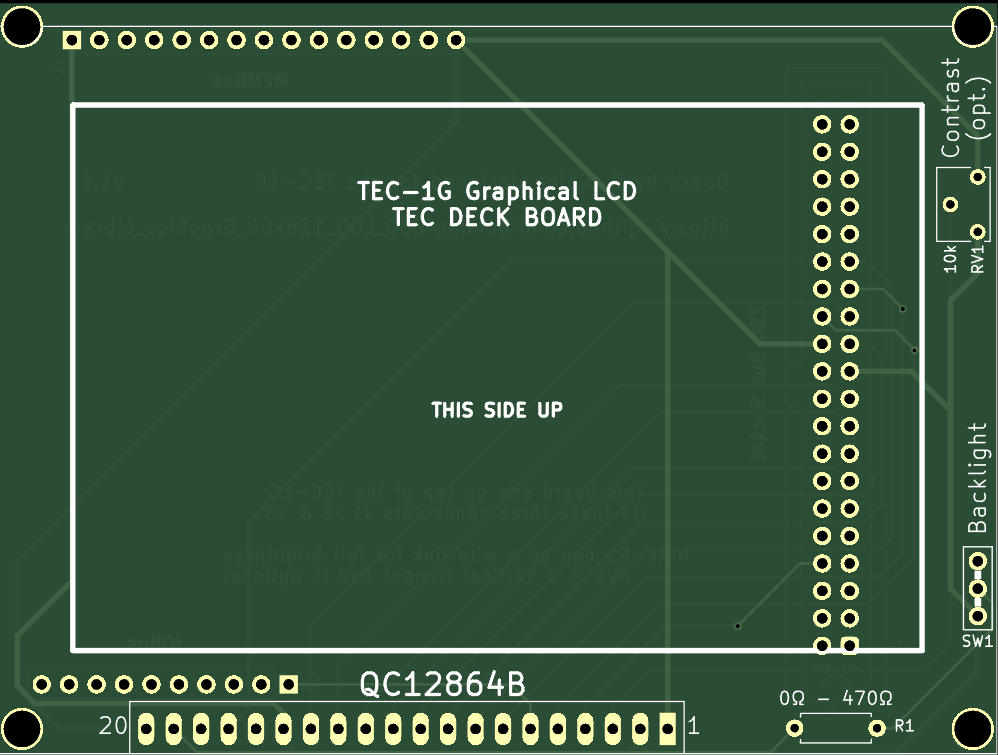
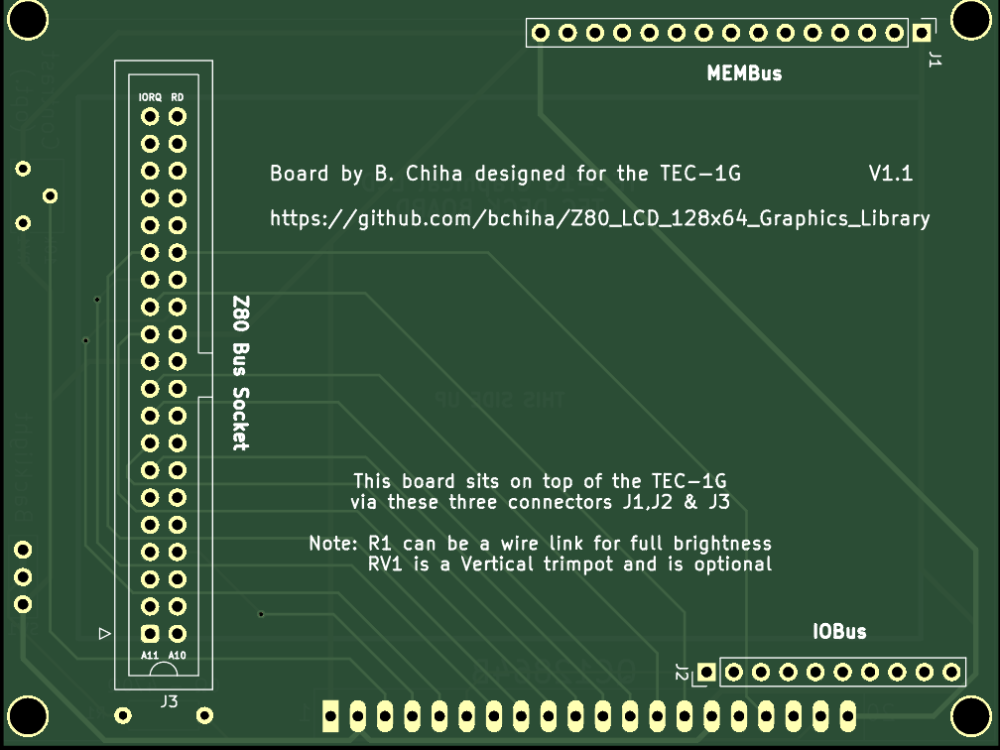

# Graphical LCD

As seen in the video made by Brian Chiha, the TEC-Deck Card for the Graphical LCD will be released in conjunction with the TEC-1G.

## Assembly Instructions

If you have purchased the GLCD Kit and want to know how best to put it together, follow these Instructions.

## LCD Screens
There are a few variants of these LCD screens, but all typically use the [ST7920](./ST7920.pdf) LCD Controller.  The LCD Screen that is used is the [QC12864B](./QC12864B.pdf).  This screen has two ST7921 Panels (128 x 32) stacked one above the other.

These screens have Graphics Display RAM (GDRAM) and Display Data RAM (DDRAM) areas.  GDRAM is for drawing pixels and DDRAM is for displaying text or characters.  Both RAM areas __can be__ displayed at the same time.

The Pinout and parallel connection to the TEC-1G for the QC12864B board is as follows:

| Pin | Name | Description | Parallel |
| --- | ---- | ----------- | -------- |
| 1 | VSS | Ground | GND |
| 2 | VDD | Power | 5v |
| 3 | V0 | Contrast | N/A |
| 4 | D/I | IR/DR | A7 |
| 5 | R/W | R/W | RD (inverted) |
| 6 | E | Enable (SCLK) | Port 7 (inverted) |
| 7 | DB0 | Data | D0 |
| 8 | DB1 | Data | D1 |
| 9 | DB2 | Data | D2 |
| 10 | DB3 | Data | D3 |
| 11 | DB4 | Data | D4 |
| 12 | DB5 | Data | D5 |
| 13 | DB6 | Data | D6 |
| 14 | DB7 | Data | D7 |
| 15 | PSB | Serial/Para | 5v |
| 16 | NC |  |
| 17 | RST | Reset | RST |
| 18 | VEE | LCD Drive | N/A |
| 19 | A | Backlight | 5v |
| 20 | K | Backlight | GND |

All pins and inverted lines are already done on the TEC-1G.  No extra components needed.

## GLCD PCB

Print your own PCB by using the Gerber file in this folder at your favourite PCB Manufacturer.

RV1 Vertical Trimpot is optional, and R1 can range from 0 Ohms (wire link) to 470 Ohms to adjust backlight brightness.

## GLCD Kit

If you want the easiest solution of getting a GLCD for your TEC-1G, you can purchase the entire kit or just the PCB from Tindie!

